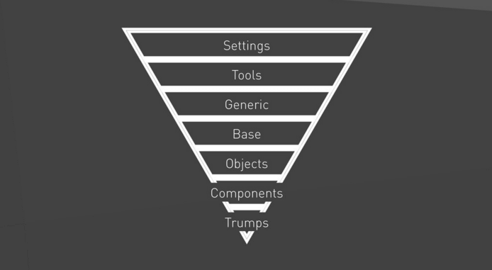

## Getting Start


1. [Install Wamp Server](https://sourceforge.net/projects/wampserver/)
2. [Install Ruby](http://rubyinstaller.org/)
3. Open Command Prompt With Ruby 

## CLI
Install
```
$ gem install sass
```
Compile SASS
```
$ sass style.scss     
```
Create a version of CSS
```
$ sass style.scss:style.css    
```    
Create a version of CSS and alterate in RunTime
```
$ sass --watch style.scss:style.css   
``` 
# More SASS
[SASS](https://github.com/sass/sass)

## Learn SCSS With ITCSS
How do I make my CSS scalable and maintainable? It’s a concern for every front-end developer. ITCSS has an answer.

## What is ITCSS?
ITCSS (SCALABLE AND MAINTAINABLE CSS ARCHITECTURE)ITCSS stands for Inverted Triangle CSS and it helps you to organize your project CSS files in such way that you can better deal with (not always easy-to-deal with) CSS specifics like global namespace, cascade and selectors specificity.




Those layers are as follows:

Settings – used with preprocessors and contain font, colors definitions, etc.
Tools – globally used mixins and functions. It’s important not to output any CSS in the first 2 layers.
Generic – reset and/or normalize styles, box-sizing definition, etc. This is the first layer which generates actual CSS.
Elements – styling for bare HTML elements (like H1, A, etc.). These come with default styling from the browser so we can redefine them here.
Objects – class-based selectors which define undecorated design patterns, for example media object known from OOCSS
Components – specific UI components. This is where majority of our work takes place and our UI components are often composed of Objects and Components
Trumps – utilities and helper classes with ability to override anything which goes before in the triangle, eg. hide helper class

## More ITCSS
[Slide ITCSS](http://slides.com/vazdanilo/organizacao-css#/31)
[Documentation](http://itcss.io/)